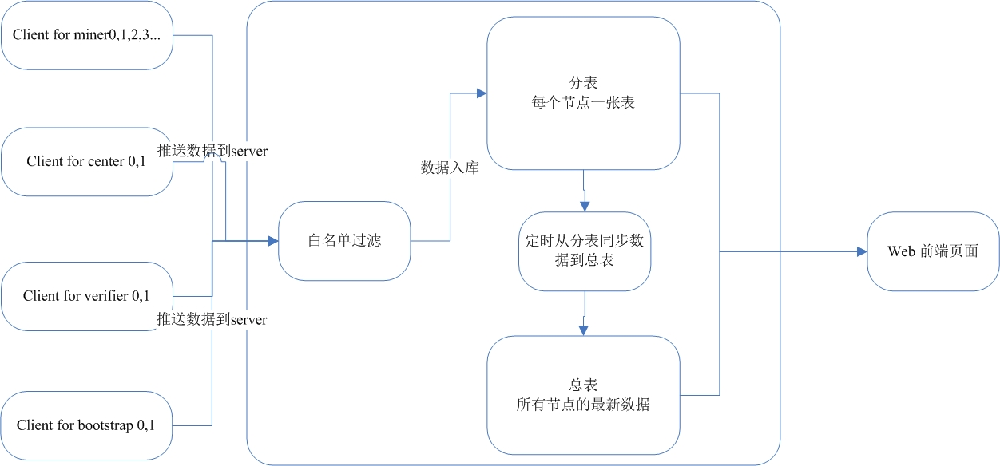

## 监控接口说明

## 1. 需求
- 云主机封SSH，监控由拉数据转为被动接收数据（推）

## 2. 设计


### 1. client上报数据到server
```bash
curl ip:port/report -X POST -H "Content-Type:application/json" --data {\"name\":\"节点名称\",\"version\":\"版本号\",\"crash\":\"crash数量\",\"method\":\"方法名称\",\"data\":\"方法放回的数据\"}
#节点名称：miner0,center0,verifier0,bootstrap0
#方法名称：state, list server
#方法返回数据：比如调用miner state方法返回的数据；或者bootstrap list server返回的数据
#返回值：请求成功返回 success
```
```bash
各个节点需要收集信息的命令
#1 版本号
./miner -v
./bootstrap -v
./center -v
./verifier -v
#2 miner
curl -s --connect-timeout 1 -m 3 http://127.0.0.1:port/state
#3 bootstrap
./bootstrap list server
#4 center
./center list server
#5 verifier
nc -z -w3 ip port
#6 indexer
curl -X POST -H 'content-type:text/json;' --data '{"id":1,"jsonrpc":"2.0","method":"AllValidMiner"}' http://indexrpc.testnet.pp.io:18030/rpc
```

### 2. server通过白名单过滤上报数据请求
  - 白名单内的上报会存入数据库
  - 白名单外的上报请求被忽略

### 3. server数据入库方式
  - 每个节点在DB中有一张分表，存储节点历史数据。有节点数据上报时，直接插入对应节点分表末尾
  - 全局有一张总表，记录所有节点的当前状态，总表的数据由定时任务从节点分表中得到更新

### 4. web前端
  - 读取总表数据，显示节点在线与否的汇总信息
  - 读取节点分表显示节点历史数据
  - web前端增加登录功能
