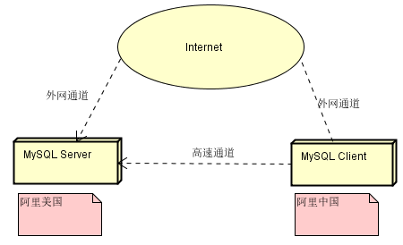
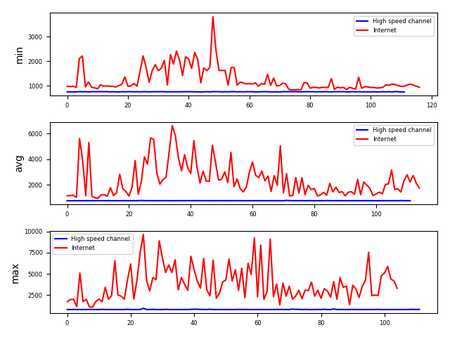
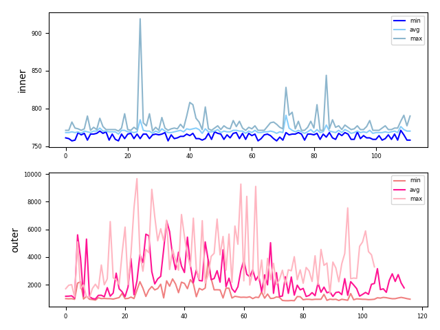
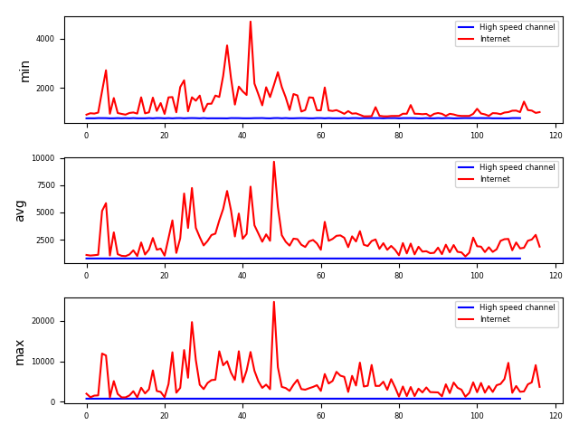
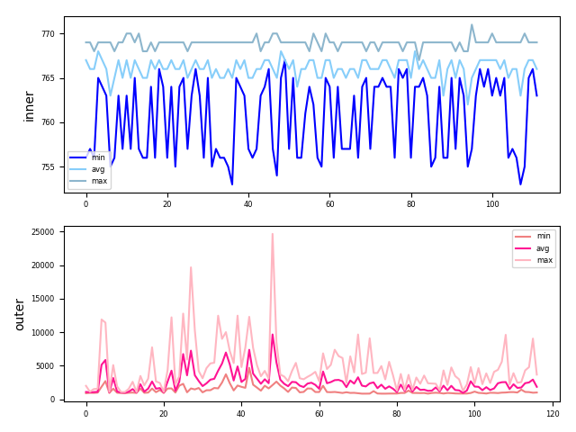
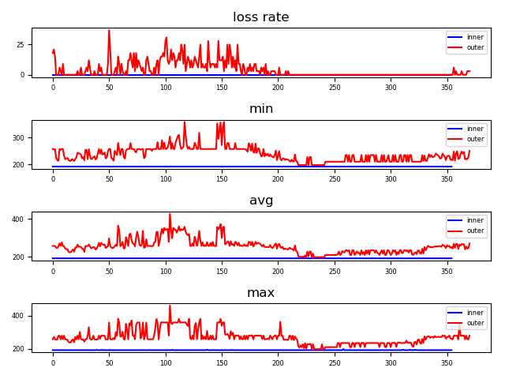
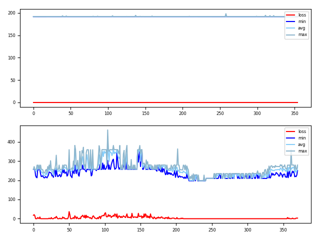

## 阿里云高速网络通道可用性验证

## 1. 需求
- 高速通道稳定性和可用性

## 2. 设计
  - 测试环境  
2 台阿里云主机（1台国外，一台国内），一台作为MYSQL服务器，一台作为MYSQL客户端


  - 测试工具  
MYSQL自带的基准测试工具mysqlslap
  - 测试内容

|-|高速通道|外网|
|--|--|--|
|mysql|insert&select|insert&select|
|ping|网速&丢包率|网速&丢包率|

## 3. 测试场景&结果
1. mysql
  - 测试场景
    - 上海 MYSQL CLIENT 通过【高速通道】定时（10分钟）向美国 MYSQL SERVER 发送查询请求，并统计时间
    - 上海 MYSQL CLIENT 通过【外网通道】定时（10分钟）向美国 MYSQL SERVER 发送查询请求，并统计时间

    ```bash
    #准备表结构
    mysql -h 172.22.199.17 -uroot -p123456
    create database test_db;
    use test_db;
    create table test_table(name varchar(64),info varchar(64));

    #准备SQL脚本
    #pre.sql
    use test_db;
    #生成insert.sql的python脚本
    for i in range(10):
        name = 64位随机字符串
        info = 64位随机字符串
        insert_cmd = "insert into test_table values({},{});\n".format(name,info)
        写入文件insert.sql
    #生成select.sql的python脚本
    按行读取insert.sql
        提取name,info字段
        select_cmd = "select * from test_table where name=\'{}\' and info=\'{}\';\n".format(name,info)
        写入文件select.sql
    #执行mysqlslap时，每个并发用户会自动从头读取.sql文件并执行
    #定时执行测试
    #inner insert
    date &>> intra_insert_log
    mysqlslap -uroot -p123456 -h 172.22.199.17 --concurrency=10 --number-of-queries=10 --create-schema=test_db --no-drop --query=./insert.sql --pre-query=./pre.sql --iterations=10 &>> /root/workspace/intra_insert_log
    #inner select
    date &>> intra_select_log
    mysqlslap -uroot -p123456 -h 172.22.199.17 --concurrency=10 --number-of-queries=10 --create-schema=test_db --no-drop  --query=./select.sql --pre-query=./pre.sql --post-query='truncate table test_table;' --iterations=10 &>> /root/workspace/intra_select_log
    #outer insert
    date &>> inter_insert_log
    mysqlslap -uroot -p123456 -h 47.90.188.121 --concurrency=10 --number-of-queries=10 --create-schema=test_db --no-drop --query=./insert.sql --pre-query=./pre.sql --iterations=10 &>> /root/workspace/inter_insert_log
    #outer select
    date &>> inter_select_log
    mysqlslap -uroot -p123456 -h 47.90.188.121 --concurrency=10 --number-of-queries=10 --create-schema=test_db --no-drop  --query=./select.sql --pre-query=./pre.sql --post-query='truncate table test_table;' --iterations=10 &>> /root/workspace/inter_select_log
    ```
    - 上海 MYSQL CLIENT 通过【外网通道】定时（10分钟）向美国 MYSQL SERVER ping，并统计 TTL 时间和丢包率
    ```bash
    date &>> intra_ping_log
    ping -t 172.22.199.17
    date &>> inter_ping_log
    ping -t 47.90.188.121
    ```

  - 测试结果
    - 整体结论：
      - 高速通道稳定，不丢包；外网网速不稳定，丢包，网速和现实时间相关
      - 走高速通道，一次完整查询需要760毫秒左右的时间；走外网查询时间不稳定，平均值在1到6秒之间波动。
      - 注意：
        - 本次测试与上次测试所用参数不一样，本次测试一次查询需要[MYSQL建立连接->执行查询->返回结果->关闭连接]；上次测试一次查询需要[执行查询->返回结果]。所以本次测试会比上次测试结果时间要长。
        - 这里没列出在美国MYSQL SERVER服务器上做本地测试的测试时间，原因是本地测试时间基本在1-2毫秒之内完成，没有另做图表

    - insert 时间比较
      - 高速通道与外网时间对比
        - 图1: 10 次 insert 中最短耗时比较；
        - 图2: 10 次 insert 平均耗时比较；
        - 图3: 10 次 insert 最大耗时比较
    
      - 同一通道内 insert 最小，平均，最大时间对比
        - 图1: 高速通道 10 次 insert 最小，平均，最大时间；
        - 图2: 外网通道 10 次 insert 最小，平均，最大时间；
    
    - select 时间比较
      - 高速通道与外网时间对比
        - 图1: 10 次 select 中最短耗时比较；
        - 图2: 10 次 select 平均耗时比较；
        - 图3: 10 次 select 最大耗时比较
    
      - 同一通道内 select 最小，平均，最大时间对比
        - 图1: 高速通道 10 次 select 最小，平均，最大时间；
        - 图2: 外网通道 10 次 select 最小，平均，最大时间；
    

    - ping 测试结果
      - 高速通道与外网对比
        - 图1：丢包率比较；
        - 图2：最小时间比较；
        - 图3：平均时间比较；
        - 图4：最大时间比较  
    
      - 同一通道内 ping 丢包率，最小，平均，最大时间对比
        - 图1：高速通道
        - 图2：外网通道
    

## 8. 参考：
[测试程序]()
