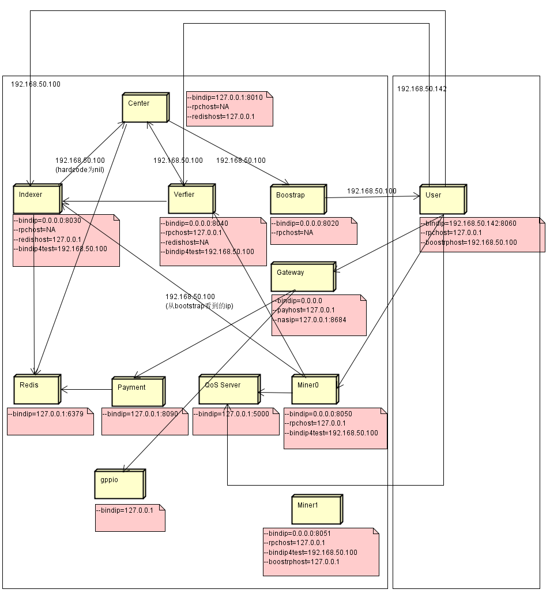
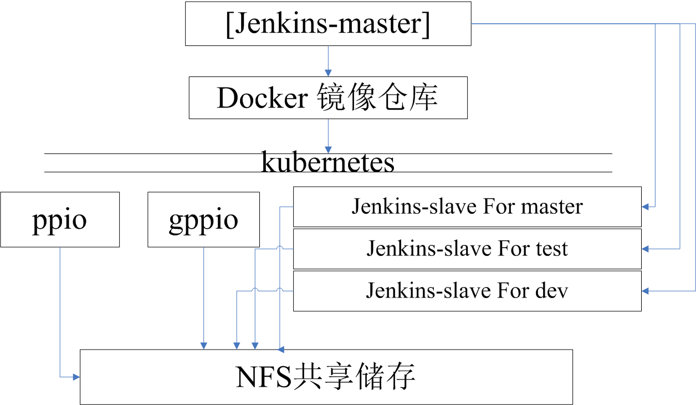

# 测试环境搭建方案草稿

|Author | Ver | Time | Description |
| ----- | --- | ----------- | ------------  |
|Tangsan   | 0.1    |2018/10/25  | Initial version|
|Cestlavie   | 0.2    |2018/10/30  | Refine doc |
|Cestlavie   | 0.3    |2018/11/22  | Add Office Regnet |

## 一 需求
  * 开发人员，每人一台虚拟机，由开发人员自行维护；
  * 但虚拟机测试环境，用于测试基本功能单元，简单集成测试，代码提交，公司
  * Regnet测试环境，用于测试重大功能和改动，包括以后的性能测试、弱网测试等

## 二 测试环境

### 1. 研发人员的VM

* 单CPU，8G内存
* 简单VM，
* centos系统
* [研发VM分配表](https://docs.google.com/spreadsheets/d/1xnyV4w1s6ic3_7AYhX9gAyscru8voG0BYsp4BdeOcRQ)

### 2. 单虚拟机测试环境（Regnet_Single）

* 在一台虚拟机内部部署，供分支测试或者提交测试使用

* 测试环境包含一套gppio环境
  * gppio-miner1 * 1
  * gppio-miner2 * 1
  * gppio-miner3 * 1
  * gppio-normal * 1
  * gppio-default * 1

* 测试环境包含各个ppio节点如下：
  * center * 1
  * bootstrap * 1
  * redis-server * 1
  * indexer * 1
  * verifier * 1
  * user * 2
  * miner * 4

* jenkins 配置

  与稳定版测试环境共用个jenkins-master例程,但两个环境有各自的构建脚本，以达到开发版测试环境按GIT提交触发构建，稳定版测试环境定时构建的目的。

* 具体流程：

  开发人员提交代码 ----> jenkins编译代码 ----> pssh分发代码到虚拟机 ----> 测试版环境执行测试

### 3. 公司测试环境（Regnet_Office）

* 在一台虚拟机内部部署，供公司其他客户端使用

* 测试环境包含一套gppio环境
  * gppio-miner1 * 1
  * gppio-miner2 * 1
  * gppio-miner3 * 1
  * gppio-normal * 1
  * gppio-default * 1

* 测试环境包含各个ppio节点如下：
  * center * 1
  * bootstrap * 1
  * redis-server * 1
  * indexer * 1
  * verifier * 1
  * miner * 5
  
* 配置


### 4. Regnet测试环境

#### 4.1 总览

* 多个docker实例上部署，跨3台物理机，12个VM
    * [Regnet资源分配](https://docs.google.com/spreadsheets/d/1xnyV4w1s6ic3_7AYhX9gAyscru8voG0BYsp4BdeOcRQ)

* 测试环境包含一套gppio环境
  * gppio-miner1 * 1
  * gppio-miner2 * 1
  * gppio-miner3 * 1
  * gppio-normal * 1
  * gppio-default * 1

* 测试环境包含各个ppio节点如下
  * center * 1
  * bootstrap * 1
  * redis-server * 1
  * indexer * 2
  * verifier * 2
  * user * 10
  * miner * 10



选择3台物理机中的1台作为主物理机，在这台物理机上部署如下环境

```
jenkins-master例程
pssh工具
kubernetes-master
```

在各VM实例上部署如下环境

```
kubernetes-node
联网组件（虚拟网桥）
```

#### 4.2 Master 节点（物理机上）
* jenkins-master例程
  * 配置文件：VMList.conf
  * 功能：持续集成，编译（调用make）和分发代码(调用pssh)

* kubernetes-master例程
  * 配置文件:kubernetes.yaml
  * 功能：操作和管理所有docker容器

```bash
# 以下配置定义了两个WEB容器，分别暴露了80和5000端口

apiVersion: v1
kind: Pod #Pod可以理解为是一个容器
metadata: #容器的元数据
name: kube100-site #容器命名空间
labels:
app: web #容器标签
spec:
containers: #定义两个WEB容器
- name: front-end
image: nginx #指定容器镜像
ports:
- containerPort: 80 #容器暴露的端口
- name: flaskapp-demo
image: jcdemo/flaskapp #指定容器镜像
ports:
- containerPort: 5000 #容器暴露端口
```

* pssh工具

  * 功能：工程文件分发到各个不同虚拟机，从虚拟机中收集docker日志
  * 指令集：

```bash
pssh：在远程多台主机上并行运行命令
pscp :把文件并行复制到多台远程主机上
prsync:使用rsync协议本地文件同步到远程多台主机上。
pnuke:在远程多台主机上并行killall某一进程
pslurp:把文件从远程多台主机上复制到本地主机上
```

#### 4.3 Slave 节点（虚拟机上）


* kubernetes-node

```bash
负责管理当前VM下的docker容器，执行kubernetes主机节点命令。对外暴露service,隐藏docker重启后IP变动的细节。
  DOCKER卷
  （1）保存docker基础镜像。所有容器从这个基础镜像启动，然后从共享磁盘中拷贝pssh推送到VM的更新到容器中。
  （2）gppio,ppio,users,miners配置文件，一个业务节点一个文件夹，里面存放业务节点相关配置，和业务节点日志。
  （3）pssh推送到VM的工程文件
  （4）虚拟机DOCKER卷的具体结构如图：
```


* 联网组件
      通过虚拟网桥，虚拟交换机，虚拟网段等方式实现docker容器跨主机互联

```
## 5. 参考文档
[kubernetes配置说明](https://blog.csdn.net/liyingke112/article/details/76155428)

[pssh(轻量级运维工具)](https://www.cnblogs.com/Dicky-Zhang/p/5988415.html)

docker容器启动流程


    1.读取DOCKER卷中的基础docker镜像，创建容器
    2.拷贝DOCKER卷中的工程文件到容器
    3.读取DOCKER卷中业务节点配置文件到容器，启动业务进程，进程输出重定向到
    4.容器退出hook，可以在此处收集日志和发邮件之类的动作，以后优化是会加上