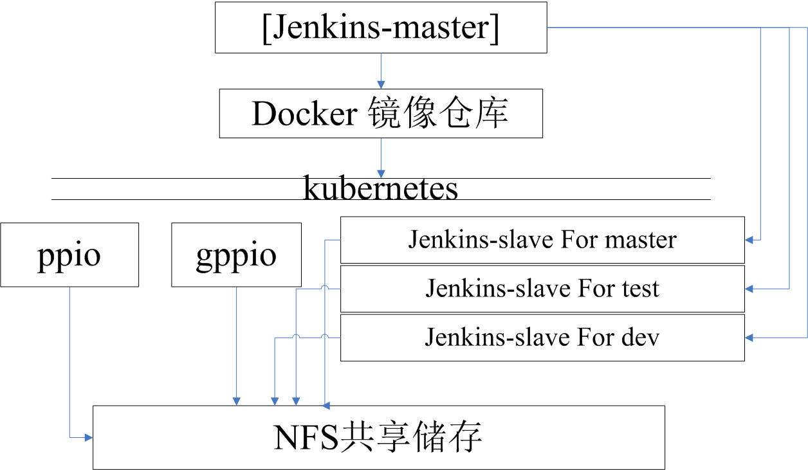

# Regnet User Manual
|Author | Ver | Time | Description |
| ----- | --- | ----------- | ------------  |
|Tangsan   | 0.1    |2018/10/30  | Initial version|
|Cestlavie   | 0.2    |2018/10/31  | Refine doc |
|Tangsan  |0.3  |2018/11/20 | Refine doc |


<!-- TOC -->
<!-- /TOC -->

# 1. 设计目标
1. 开发人员，每人一台虚拟机，由开发人员自行维护；
2. 开发版测试环境，用于测试基本功能单元，简单集成测试，代码提交
3. 稳定版测试环境，用于测试重大功能和改动，包括以后的性能测试、弱网测试等

# 2. 测试环境划分
  - __研发人员的VM__
    - 简单VM，centos系统，具体分配见表
[研发VM分配表](https://docs.google.com/spreadsheets/d/1xnyV4w1s6ic3_7AYhX9gAyscru8voG0BYsp4BdeOcRQ)
    - VM中会运行一个DOCKER容器，这个DOCKER容器负责对研发的个人开发分支做自动化测试，测试触发方式暂时为研发手动触发。

  - __开发版测试环境__
    - __稳定版测试环境__  
    redis节点

| 节点 | 节点数量 | IP分配方式 | 服务IP | RPC端口 | 主进程 | 镜像 | 内存 | 硬盘 |
| ---- | - | :---: | :---: | :---: | :---: | :---: | :---: | :---: |
| redis | 1 | 动态 | 10.96.200.202 | 6379 | redis | redis:latest | 未限制 | 未限制 |

    elk节点

| 节点 | 节点数量 | IP分配方式 | 服务IP | 服务端口 | 主机服务端口 | 主进程 | 镜像 | 内存 | 硬盘 |
| ---- | - | :---: | :---: | :---: | :---: | :---: | :---: | :---: | :---: |
| logstash | 1 | 动态 | 10.101.1.4 | 5000 | 31500 | logstash | logstash:latest | 未限制 | 未限制 |
| elasticsearch | 1 | 动态 | 10.105.10.139 | 9200 | 31920 |redis | elasticsearch:6.4.2 | 未限制 | 未限制 |
| kibana | 1 | 动态 | 10.110.146.65 | 5601 | 31561 |kibana | kibana:6.4.2 | 未限制 | 未限制 |

    1套gppio节点

| 节点 | 节点数量 | IP分配方式 | 服务IP | RPC端口 | 主进程 | 镜像 | 内存 | 硬盘 |
| ---- | - | :---: | :---: | :---: | :---: | :---: | :---: | :---: |
| default | 1 | 动态 | 10.96.200.201 | 8680 8684 8685 8888 8086 | default | ubuntuforgolang:v1 | 未限制 | 未限制 |
| normal  | 1 | 动态 | 10.96.200.201 | 8880 8884 8884 8086 | default | ubuntuforgolang:v1 | 未限制 | 未限制 |
| miner.1 | 1 | 动态 | 10.96.200.201 | 18784 18785 18780 | default | ubuntuforgolang:v1 | 未限制 | 未限制 |
| miner.2 | 1 | 动态 | 10.96.200.201 | 28784 28785 28780 | default | ubuntuforgolang:v1 | 未限制 | 未限制 |
| miner.3 | 1 | 动态 | 10.96.200.201 | 38784 38785 38780 | default | ubuntuforgolang:v1 | 未限制 | 未限制 |

    2套ppio节点

| 节点 | 节点数量 | IP分配方式 | 服务IP | RPC端口 | 主进程 | 镜像 | 内存 | 硬盘 |
| ---- | - | :---: | :---: | :---: | :---: | :---: | :---: | :---: |
| center | 1 | 动态 | 10.96.200.203 | 8010 18010 | center | ubuntuforgolang:v1 | 未限制 | 未限制 |
| center | 1 | 动态 | 10.96.200.204 | 8011 18011 | center | ubuntuforgolang:v1 | 未限制 | 未限制 |
| bootstrap | 1 | 动态 | 10.96.200.205 | 8020 18020 | bootstrap | ubuntuforgolang:v1 | 未限制 | 未限制 |
| bootstrap | 1 | 动态 | 10.96.200.206 | 8021 18021 | bootstrap | ubuntuforgolang:v1 | 未限制 | 未限制 |
| indexer | 1 | 动态 | 10.96.200.207 | 8030 18030 | indexer | ubuntuforgolang:v1 | 未限制 | 未限制 |
| indexer | 1 | 动态 | 10.96.200.208 | 8031 18031 | indexer | ubuntuforgolang:v1 | 未限制 | 未限制 |
| verifier | 1 | 动态 | 10.96.200.209 | 8040 18040 | verifier | ubuntuforgolang:v1 | 未限制 | 未限制 |
| verifier | 1 | 动态 | 10.96.200.210 | 8041 18041 | verifier | ubuntuforgolang:v1 | 未限制 | 未限制 |
| paymentproxy | 1 | 动态 | 10.96.200.211 | 8090 18090 | paymentproxy | ubuntuforgolang:v1 | 未限制 | 未限制 |
| paymentproxy | 1 | 动态 | 10.96.200.212 | 8091 18091 | paymentproxy | ubuntuforgolang:v1 | 未限制 | 未限制 |
| gateway | 1 | 动态 | 10.96.200.213 | 8070 18070 | gateway | ubuntuforgolang:v1 | 未限制 | 未限制 |
| gateway | 1 | 动态 | 10.96.200.214 | 8071 18071 | gateway | ubuntuforgolang:v1 | 未限制 | 未限制 |
| miner | 10 | 动态 | NULL | 8050 18050 - 8059 18059 | miner | ubuntuforgolang:v1 | 未限制 | 未限制 |
| user | 10 | 动态 | NULL | 8060 18060 - 9069 18069 | ppio | ubuntuforgolang:v1 | 未限制 | 未限制 |

# 3. 整体结构

1. __设计思路__  
  - 业务节点隔离：所有业务节点（gppio bootstrap indexer verifier paymentproxy gateway center ppio miner）都单独运行在一个DOCKER容器内；
  - DOCKER镜像维护：搭建本地私有DOCKER镜像仓库
  - DOCKER编排：采用kuberenetes进行DOCKER容器管理
  - CI：jenkins同时操作kubernetes，管理测试用例的执行和GO工程编译；
  - 代码，配置发布和日志收集：采用网络共享文件的方式进行代码发布和日志收集工作；
2. __jenkins__  
  - Jenkins部署采用master+slaves的分布式部署方式
  - master位置:192.168.50.206
  - 用途：任务调度，配置和节点管理
  - 访问地址：http://192.168.50.206:8080
  - 用户名：PPlabs-regnet
  - 密码：PPlabs!@#123
  - slave节点管理
    - 登录jenkins服务器 http://192.168.50.206:8080/
    - 点击左侧[Manage jenkins]
    - 点击[Manage node]
    - 可以在此处添加，删除slave节点信息 http://192.168.50.206:8080/computer/
  - slave节点见下表

| 节点 | IP | 类型 | 用途 | 维护人员 |
| ---- | - | :---: | :---: | :---: |
| regnet-master-slave | 10.96.200.215 | DOCKER | master分支regnet测试构建 | Tangsan |
| dev_build_node_base_fengzhihen | 192.168.50.215 | VM | dev分支手动构建 | Qiyu |
| dev_build_node_base_dohko | 192.168.50.216 | VM | dev分支手动构建 | Qiyu |
| dev_build_node_base_bumblebee | 192.168.50.217 | VM | dev分支手动构建 | Qiyu |
| dev_build_node_base_aldo | 192.168.50.218 | VM | dev分支手动构建 | Qiyu |
| dev_build_node_base_thor | 192.168.50.219 | VM | dev分支手动构建 | Qiyu |
| office-regnet | 192.168.50.220 | VM | 公司内部人员体验 | Cestlavie |
| dev_build_node_base_viktor | 192.168.50.221 | VM | dev分支手动构建 | Qiyu |
| dev_branch_submit_build | 192.168.50.230 | VM | test分支代码提交构建 | Qiyu |

3. __docker 镜像仓库__
  - 访问地址:192.168.50.208
  - 端口:5000
  - 功能: 存储DOCKER镜像
  - 镜像提交步骤：
    - 设置DOCKER环境
      - echo '{ "insecure-registries":["192.168.50.208:5000"] }' > /etc/docker/daemon.json
      - systemctl restart docker.service #重启DOCKER
    - docker pull redis:latest #从网络下载基础镜像
    - docker run -ti redis:latest /bin/bash #创建容器，在容器内修改镜像的文件系统（安装卸载软件，修改配置等）
    - ctrl 加 p 然后 ctrl 加 q建 #退出容器
    - docker commit 容器名称 redis:latest #提交修改
    - docker tag redis:latest 192.168.50.208:5000/redis:v1 #给镜像打上本地镜像仓库的标签
    - docker push 192.168.50.208:5000/redis:v1 #将镜像提交到本地仓库
    - docker pull 192.168.50.208:5000/redis:v1 #从仓库中拉库镜像

4. __kubernetes__  
  - kubernetes采用master+slaves的分布式部署方式
  - master位置:192.168.50.206
  - slave机器列表

| 节点 | IP | 类型 |
| :---: | :---: | :---: |
| master | 192.168.50.206 | maste
| lz-1 | 192.168.50.207 | slave |
| lz-2 | 192.168.50.208 | slave |
| vm21-231 | 192.168.50.231 | slave |
| vm21-232 | 192.168.50.232 | slave |
| vm21-233 | 192.168.50.233 | slave |
| vm21-234 | 192.168.50.234 | slave |
| vm21-235 | 192.168.50.235 | slave |
| vm21-236 | 192.168.50.236 | slave |
| vm21-237 | 192.168.50.237 | slave |
| vm21-238 | 192.168.50.238 | slave |
| vm21-239 | 192.168.50.239 | slave |
| vm21-240 | 192.168.50.240 | slave |
| vm21-241 | 192.168.50.241 | slave |
| vm21-242 | 192.168.50.242 | slave |

6. __NFS网络共享文件系统__  
  - nfs server IP：192.168.50.206
  - 共享目录： /home/NFS
  - 功能：保存业务节点日志，工程文件由所有DOCKER容器共享
  - 注：这个目录是供DOCKER容器使用的，个人如果需要创建自己的工作目录，请到/home下穿件和修改
  - 使用NFS步骤
    - yum -y install nfs-utils rpcbind #安装NFS客户端  
    - systemctl enable rpcbind #配置开机启动
    - systemctl start rpcbind #启动NFS客户端
    - showmount -e 192.168.50.206 #查看206上的共享文件夹
    - mount 192.168.50.206:/home/nfs /home/workspace #将206上的/home/nfs挂载到本地目录
  - NFS目录结构
    - go 工程目录
    - regnet-tools 工具脚本目录
      - deploy.sh 分发一份干净配置到各个虚拟机
      - setup.sh 启动节点
      - teardown.sh 停止节点
      - check.sh 检查各个节点状态
      - ppio_ops.sh 操作MINER USER节点的脚本
      - run.sh 在DOCKER容器内启动主程序的脚本
      - gen_kube_node.sh 部署kubernetes slave节点环境的脚本
      - prepare_kube_env 准备kubernetes安装环境的脚本
      - build.sh 代码编译脚本
    - regnet-config 此目录保存一份最干净的原始配置
      - master
        - gppio
          - config
        - center
          - config
        - bootstrap
          - config
        - verifier
          - config
        - indexer
          - config
        - paymentproxy
          - config
        - gateway
          - config
      - test
    - regnet-logs 保存各个节点的CONSOLE日志
      - master
        - gppio
          - logs
        - center
          - logs
        - bootstrap
          - logs
        - verifier
          - logs
        - indexer
          - logs
        - paymentproxy
          - logs
        - gateway
          - logs
      - test 目录结构同master
    - kube-config 节点的kubernetes配置文件
      - global 全局节点的kubernetes配置文件
        - redis
        - logstash
        - kibana
        - elasticsearch
        - gppio
        - env-A A网节点kubernetes配置文件
          - pod 节点POD配置文件
            - center
            - bootstrap
            - verifier
            - indexer
            - paymentproxy
            - gateway
          - svc 节点service配置文件
            - center
            - bootstrap
            - verifier
            - indexer
            - paymentproxy
            - gateway
        - env-B B网节点kubernetes配置文件
          - pod 节点POD配置文件
            - center
            - bootstrap
            - verifier
            - indexer
            - paymentproxy
            - gateway
          - svc 节点service配置文件
            - center
            - bootstrap
            - verifier
            - indexer
            - paymentproxy
            - gateway

# 4. kubernetes
1. __概念__
  - _pod_
    - kubernetes以POD为单位管理所有正在运行的DOCKER容器，一个POD中可以包含一个或多个DOCKER容器，同一POD中的DOCKER容器之间可以通过LOCALHOST互相访问。
  - _replication controler_
    - kubernetes副本管理器维护后端提供服务的服务器数量不变。
  - _service_
    - kubernetes中service不是容器，可以理解为PROXY或者负载均衡器。当一个请求发送给service后，service或根据POD的label标签把请求转发给特定的POD处理。service的类型主要有三种，分别为：
      - clusterIP:用于集群内部各个DOCKER容器之间访问服务，但是集群外部无法访问这种类型的service；
      - balancer:作为负载均很器使用，集群外部也无法访问这个service；
      - NodePort:将POD暴露出来的端口通过端口映射映射到主机端口上，这样集群外部也可以访问集群内部的服务。
  - 配置文件
    - kubernetes采用YAML格式的配置文件，可配置内容包括
      - YAML
        - yaml文件中锁紧是以空格来做的，TAB非法
        - 不支持'\_','.'但是支持'-'
      - POD
        - 在那台机器上运行POD
        - POD暴露的端口，端口协议，端口名称，映射主机端口
        - 资源限制
        - DOCKER容器探针
        - DOCKER VOLUME
      - REPLICATION_CONTROLER
        - 需要维护的服务副本数
      - Service
        - 类型：clusterIP, balancer, nodePort
        - 服务端口
        - service后端的真正提供服务的POD的选择器

    ```
    apiVersion: v1  #api version
    kind: Service  #资源类型
    metadata:  #元数据
        name: redis  #service名称
        labels:  
            app: redis  #service标签
    spec:  
        selector:  #用于service选择需要代理或者负载均很的POD
            app: redis  #POD的标签(key:value)
        clusterIP: 10.96.200.202  #clusterip类型的service
        ports:  #service暴露的端口
            - port: 6379  #service对外服务端口
              targetPort: 6379  #POD对外服务端口
              name: redis-port  #端口名
              protocol:tcp #端口协议
    ```

2. __kubernetes环境部署__
  - 部署环境: centos 7
  - kubernetes 版本：v1.12.2
  - docker 版本：17.03.2-ce
  - 主节点部署
    - 关闭防火前
    ```
    systemctl stop firewalld
    systemctl disable firewalld
    ```
    - 关闭SWAP
    ```
    swapoff -a
    sed -i 's/.*swap.*/#&/' /etc/fstab
    ```

    - 关闭SELINUX
    ```
    setenforce  0
    sed -i "s/^SELINUX=enforcing/SELINUX=disabled/g" /etc/sysconfig/selinux
    sed -i "s/^SELINUX=enforcing/SELINUX=disabled/g" /etc/selinux/config
    sed -i "s/^SELINUX=permissive/SELINUX=disabled/g" /etc/sysconfig/selinux
    sed -i "s/^SELINUX=permissive/SELINUX=disabled/g" /etc/selinux/config
    ```

    - kubernetes网络相关配置
    ```
    modprobe br_netfilter
    cat <<EOF >  /etc/sysctl.d/k8s.conf
    net.bridge.bridge-nf-call-ip6tables = 1
    net.bridge.bridge-nf-call-iptables = 1
    net.ipv4.ip_forward = 1
    vm.swappiness = 0
    EOF
    sysctl -p /etc/sysctl.d/k8s.conf
    ls /proc/sys/net/bridge
    ```

    - 配置阿里云REPO（公司内部可以不配）
    ```
    cat <<EOF > /etc/yum.repos.d/kubernetes.repo
    [kubernetes]
    name=Kubernetes
    baseurl=https://mirrors.aliyun.com/kubernetes/yum/repos/kubernetes-el7-x86_64/
    enabled=1
    gpgcheck=1
    repo_gpgcheck=1
    gpgkey=https://mirrors.aliyun.com/kubernetes/yum/doc/yum-key.gpg https://mirrors.aliyun.com/kubernetes/yum/doc/rpm-package-key.gpg
    EOF
    ```

    - 配置NTP  
    ```
    yum install -y epel-release  
    yum install -y yum-utils  
     device-mapper-persistent-data lvm2 net-tools conntrack-tools wget ntpdate libseccomp   libtool-ltdl  
    systemctl enable ntpdate.service  
    echo '*/30 * * * * /usr/sbin/ntpdate   time7.aliyun.com >/dev/null 2>&1' > /tmp/crontab2.tmp
    crontab /tmp/crontab2.tmp  
    systemctl start ntpdate.service  
    echo "* soft nofile 65536" >> /etc/security/limits.conf
    echo "* hard nofile 65536" >> /etc/security/limits.conf
    echo "* soft nproc 65536"  >> /etc/security/limits.conf
    echo "* hard nproc 65536"  >> /etc/security/limits.conf
    echo "* soft memlock  unlimited"  >> /etc/security/limits.conf
    echo "* hard memlock  unlimited"  >> /etc/security/limits.conf
    ```

    - 安装DOCKER
    ```
    scp root@192.168.50.206:、/home/nfs/docker/docker-ce-* ./
    #yum localinstall -y docker-ce-17.03.2.ce-1.el7.centos.x86_64.rpm docker-ce-selinux-17.03.2.ce-1.el7.centos.noarch.rpm
    echo '{ "insecure-registries":["192.168.50.208:5000"] }' > /etc/docker/daemon.json
    systemctl enable docker.service
    systemctl start docker.service
    docker version
    rm -rf docker-ce-*
    ```

    - REPO配置
      - 创建文件/etc/yum.repos.d/docker.repo,内容如下:
    ```
    [dockerrepo]
    name=Docker Repository
    baseurl=https://yum.dockerproject.org/repo/main/centos/7/
    enabled=1
    gpgcheck=1
    gpgkey=https://yum.dockerproject.org/gpg
    ```
      - 创建文件/etc/yum.repos.d/kubernetes.repo,内容如下：
    ```
    [kubernetes]
    name=Kubernetes
    baseurl=https://mirrors.aliyun.com/kubernetes/yum/repos/kubernetes-el7-x86_64/
    enabled=1
    gpgcheck=1
    repo_gpgcheck=1
    gpgkey=https://mirrors.aliyun.com/kubernetes/yum/doc/yum-key.gpg https://mirrors.aliyun.com/kubernetes/yum/doc/rpm-package-key.gpg
    ```

    - 安装kubernetes
    ```
    echo "KUBELET_EXTRA_ARGS=--fail-swap-on=false" > /etc/sysconfig/kubelet
    yum makecache fast
    yum install -y kubelet kubeadm kubectl kubernetes-cni
    systemctl daemon-reload
    systemctl enable kubelet.service
    systemctl start kubelet
    ```

    - 初始化集群
    ```
    kubeadm init --kubernetes-version=v1.12.2 --pod-network-cidr=10.244.0.0/16 --apiserver-advertise-address=0.0.0.0
    mkdir -p $HOME/.kube
    cp -i /etc/kubernetes/admin.conf $HOME/.kube/config
    chown $(id -u):$(id -g) $HOME/.kube/config
    export KUBECONFIG=/etc/kubernetes/admin.conf
    ```

    - 配置flannel
    ```
    wget https://raw.githubusercontent.com/coreos/flannel/master/Documentation/kube-flannel.yml
    kubectl apply -f kube-flannel.yml
    ```

    - 使kubernetes的master节点可调度
    ```
    kubectl taint nodes --all node-role.kubernetes.io/master-
    ```

    - 验证
    ```
    kubectl get pod --all-namespaces -o wide
    ```

  - slave节点配置
    - 关闭防火前
    - 关闭SWAP
    - 关闭SELINUX
    - kubernetes网络相关配置
    - 配置阿里云REPO（公司内部可以不配）
    - 配置NTP
    - 安装DOCKER
    - REPO配置
      - 创建文件/etc/yum.repos.d/docker.repo
      - 创建文件/etc/yum.repos.d/kubernetes.repo
    - 安装kubernetes
    - 加入集群
    ```
    主节点执行：kubeadm token create 拷贝生成的TOKEN串
    在SLAVE节点执行以下命令：
    scp root@192.168.50.206:/etc/kubernetes/admin.conf /etc/kubernetes/admin.conf
    echo 'export KUBECONFIG=/etc/kubernetes/admin.conf' >> ~/.bashrc
    source ~/.bashrc
    kubeadm join 192.168.50.206:6443 --token TOKEN串 --discovery-token-unsafe-skip-ca-verification
    ```
    - 验证
    ```
    kubectl get nodes
    ```

  - kubernetes 使用（以下命令主从节点都可以执行）  
    - kubectl get 资源类型（单复数都可以）
      - 功能：获取集群内资源列表
      - 例子：
        - kubectl get pods 获取POD列表
        - kubectl get svc 获取SERVICE列表
        - kubectl get rc 获取副本管理器列表
        - kubectl get namespaces 获取namespace列表
    - kubectl create -f 配置文件路径
      - 功能：创建kubernetes资源（POD,SERVICE,RC,namespaces）
      - 例子：
        - kubectl create -f redispod.yml 创建POD资源
        - kubectl create -f redisservice.yml 创建SERVICE资源
        - kubectl create -f redisrc.yml 创建副本管理器资源
    - kubectl logs 资源名
      - 功能：获取日志
      - 例子：
        - kubectl logs redispod 获取POD的日志
        - kubectl logs redispod containerInPod 获取POD中指定容器的日志
    - kubectl describe 资源名
      - 功能：排查POD启动过程中的错误
      - 例子：
        - kubectl describe redispod 查看POD的详细描述
    - kubectl delete 资源类型 资源名
      - 功能：从集群中删除资源
      - 例子：
        - kubectl delete pods redispod 删除名为redispod的POD
        - kubectl delete rc redisrc 删除名为redisrc的副本管理器
    - kubectl exec POD名称 -- SHELL命令
      - 功能： 在POD中执行脚本
      - 例子：
        - kubectl exec user0 -- echo hello
        - kubectl exec miner0 -- ping 192.168.50.206

# 5. 集群网络环境
  - __POD所在网段__ 10.244.0.0/16
  - __SERVICE所在网段__ 10.96.0.0/16
  - __虚拟机局域网IP__ 192.168.0.0/16
  - __注：__ 在有flannel的集群环境中，三个网段之间可以互相ping通

# 6.  加入和退出集群
1. __加入集群__
  - 准备环境
    - 配置SSH免密码登录  
      ssh-copy-id 192.168.50.206
    - 生成TOKEN
      ssh root@192.168.50.206
      kubeadm token create
      记录TOKEN
      exit
    - 从主节点COPY脚本  
      scp root@192.168.50.206:/root/gen_kube_node.sh ./
    - 部署NFS客户端  
        yum -y install nfs-utils rpcbind  
        systemctl enable rpcbind  
        systemctl start rpcbind  
        验证是否安装成功  
        showmount -e 192.168.50.206
    - 部署kubernetes node环境  
      ./gen_kube_node.sh 主机名 之前生成的TOKEN  
      最后终端输出‘complelte’表示kubernetes node环境部署成功
  - 环境验证
    - 登录192.168.50.206
    - kubectl get nodes  
      如果列表雷冕有你自己的机器，说明部署已经成功
    - 给机器打标签（用于任务调度 nodeSelector）  
      在1192.168.50.206上执行  
      kubectl label nodes 主机名 key=value
2. __退出集群__
  - 在主节点执行  
    kubectl delete nodes node名
  - 在从节点上执行
    systemctl stop kubelet.service
3. __其他方法__
  - kubernetes提供其他方法将机器加入到kubernetes的调度节点中和从调度中移除。具体请参考  
  kubectl cordon 命令  
  kubectl uncordon 命令

# 10. 相关脚本文件
[脚本文件](https://github.com/PPIO/ppio-tests/tree/master/docs/regnet/scripts)

[python kubernetes library](https://github.com/kubernetes-client/python)

[kubernetes中文社区](https://www.kubernetes.org.cn/docs)

[kubernetes官方文档](https://kubernetes.io/docs/tutorials/kubernetes-basics/)
