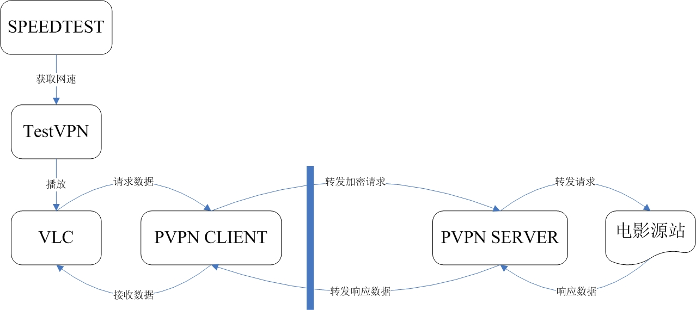

## pvpn测试工具

## 1. 需求
- 测试国外用户观看国内电影

## 2. 设计

- 编译环境：Visual Studio 2017
- 平台：WIN10 x64
- 依赖：
  - libvlc
  - speedtest.exe
  - pvpn.exe
- 测试结果
  - 自动收集的信息
    - 地理位置
    - 网络运营商
    - 网络带宽
    - 网络延迟
    - 网络丢包
    - 视频时长&视频播放时长（秒）
  - 用户需要填写的内容：
    - 播放是否卡顿
    - 播放是否花屏
